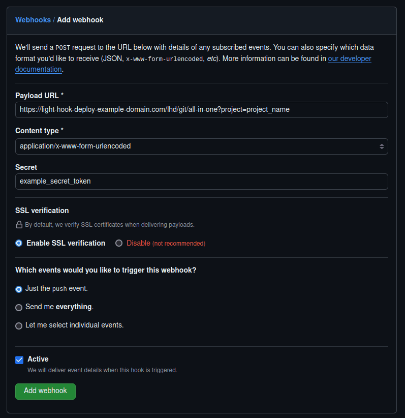
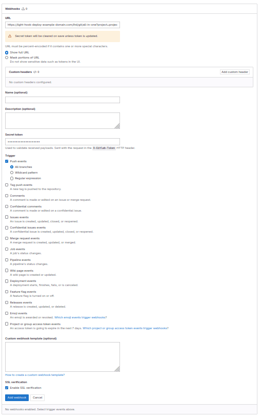
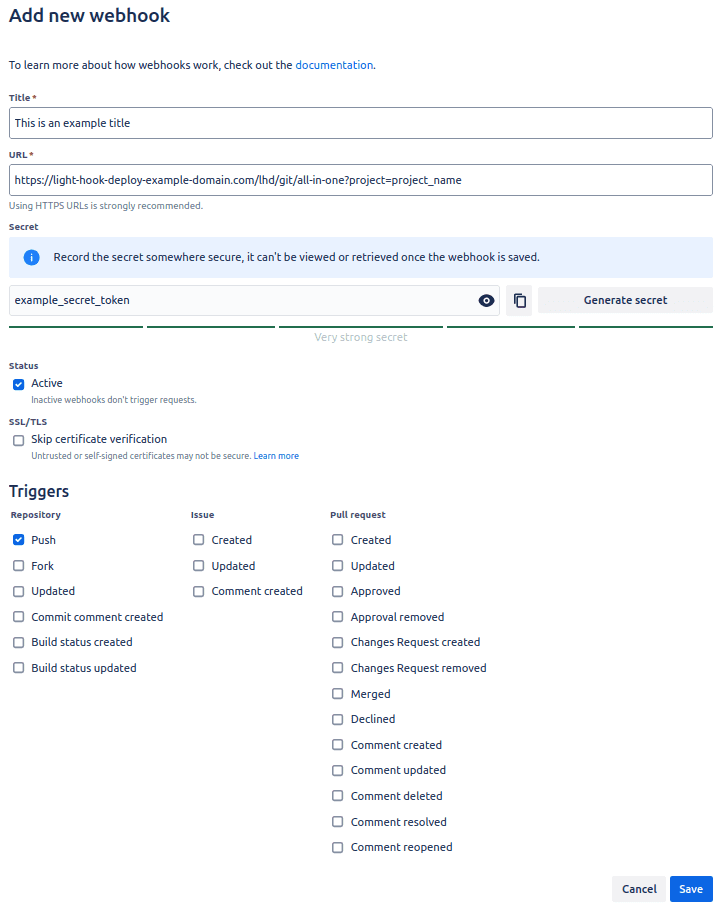

# 🐙 Configuring a Webhook for Light Hook Deploy on GitHub

To set up a webhook on GitHub for Light Hook Deploy, follow these steps:

1. **Navigate to Your Repository Settings:**

- Go to your GitHub repository.
- Click on **Settings**.
- Select **Webhooks** from the sidebar.
- Click on **Add webhook**.

2. **Set Up the Webhook:**

- **Payload URL**: Enter the URL of the endpoint that will handle the webhook requests. This should be the URL of your Light Hook Deploy instance, with the endpoint to handle the webhook, for example:

```ruby
https://light-hook-deploy-example-domain.com/lhd/git/all-in-one?project=project_name
```


Replace `light-hook-deploy-example-domain.com` with your actual domain or IP address, and `project_name` with the name of your project.

- **Content type**: Choose either `application/json` or `application/x-www-form-urlencoded`. Both formats are acceptable.

- **Secret**: Enter the token you established when configuring your project for deployment. This token ensures that the webhook request is authenticated and valid.


3. **Configure Webhook Events:**

**Which events would you like to trigger this webhook?**: Select the events that should trigger the webhook. You can choose from various events such as pushes, pull requests, and more, depending on your needs.

4. **Save the Webhook:**

Click **Add webhook** to save your configuration.

### Example Configuration for GitHub

<p align="center">
  
</p>


# 🦊 Configuring a Webhook for Light Hook Deploy on GitLab

To set up a webhook on GitLab for Light Hook Deploy, follow these steps:

1. **Navigate to Your Repository Settings:**

- Go to your GitLab repository.
- Click on **Settings**.
- Select **Webhooks** from the sidebar.
- Click on **Add new webhook**.

2. **Set Up the Webhook:**

- **URL**: Enter the URL of the endpoint that will handle the webhook requests. This should be the URL of your Light Hook Deploy instance, with the endpoint to handle the webhook, for example:

```ruby
https://light-hook-deploy-example-domain.com/lhd/git/all-in-one?project=project_name
```

Replace `light-hook-deploy-example-domain.com` with your actual domain or IP address, and `project_name` with the name of your project.

- **Secret**: Enter the token you established when configuring your project for deployment. This token ensures that the webhook request is authenticated and valid.

- **Custom Headers**: You do not need to set anything here.

- **Name** and **Description**: These fields are optional and can be set if you wish to provide additional details about the webhook.


3. **Setting up Webhook Triggers:**

- **Trigger:** Select the events that should trigger the webhook. Choose the events relevant to your deployment needs, such as pushes, merges, or other actions.

4. **Add the Webhook:**

Click **Add webhook** to save your configuration.

### Example Configuration for GitLab

<p align="center">
  
</p>


# 🦉 Configuring a Webhook for Light Hook Deploy on Bitbucket

To set up a webhook on Bitbucket for Light Hook Deploy, follow these steps:

1. **Navigate to Your Repository Settings:**

- Go to your Bitbucket repository.
- Click on **Repository settings**.
- In the **Workflow** section, select **Webhooks**.
- Click on **Add webhook**.

2. **Set Up the Webhook:**

- **Title:** Enter a title for your webhook. This is for your reference and does not affect the functionality.
- **URL:** Enter the URL of the endpoint that will handle the webhook requests. This should be the URL of your Light Hook Deploy instance, with the endpoint to handle the webhook, for example:

```ruby
https://light-hook-deploy-example-domain.com/lhd/git/all-in-one?project=project_name
```

Replace `light-hook-deploy-example-domain.com` with your actual domain or IP address, and `project_name` with the name of your project.

- **Secret:** Enter the token you established when configuring your project for deployment. This token ensures that the webhook request is authenticated and valid.

- **Triggers:** Select the triggers that should activate the webhook. Choose the events relevant to your deployment needs, such as pushes, pull requests, or other actions.

3. **Save the Webhook:**

- Click **Save** to apply your configuration.

### Example Configuration for Bitbucket

<p align="center">
  
</p>

[Return to Webhook-based Deployments](./webhook-based-deployments.md)